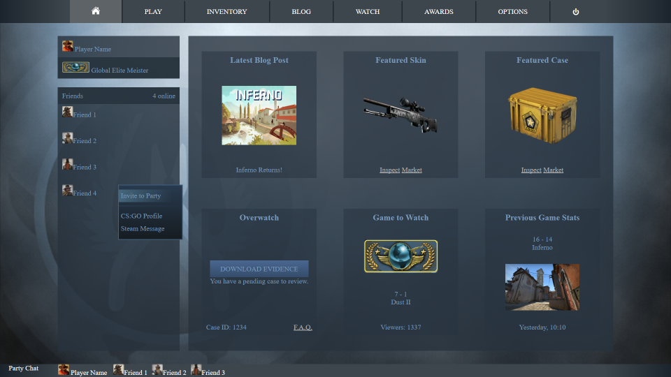
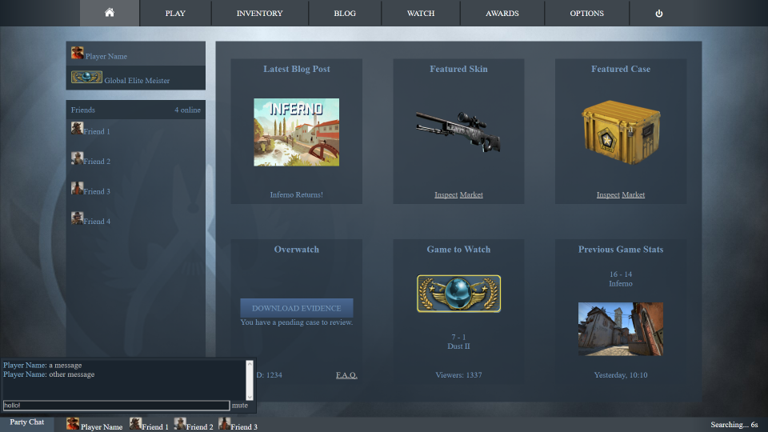
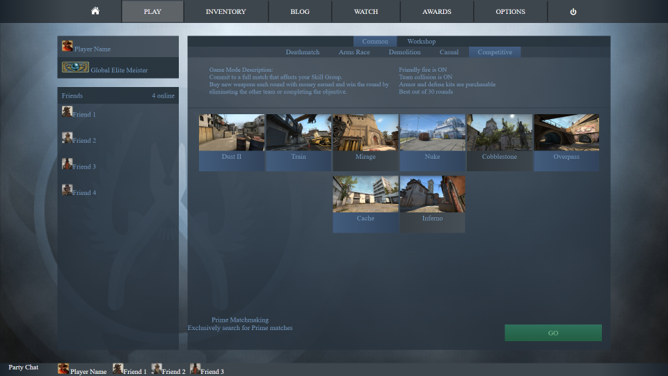
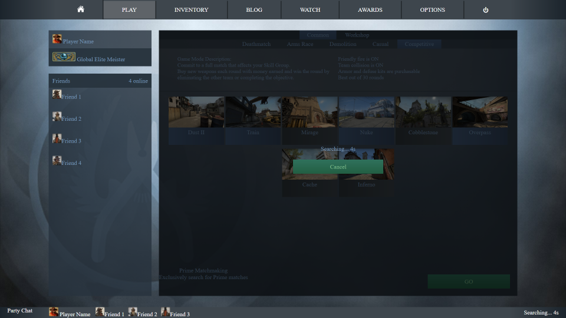
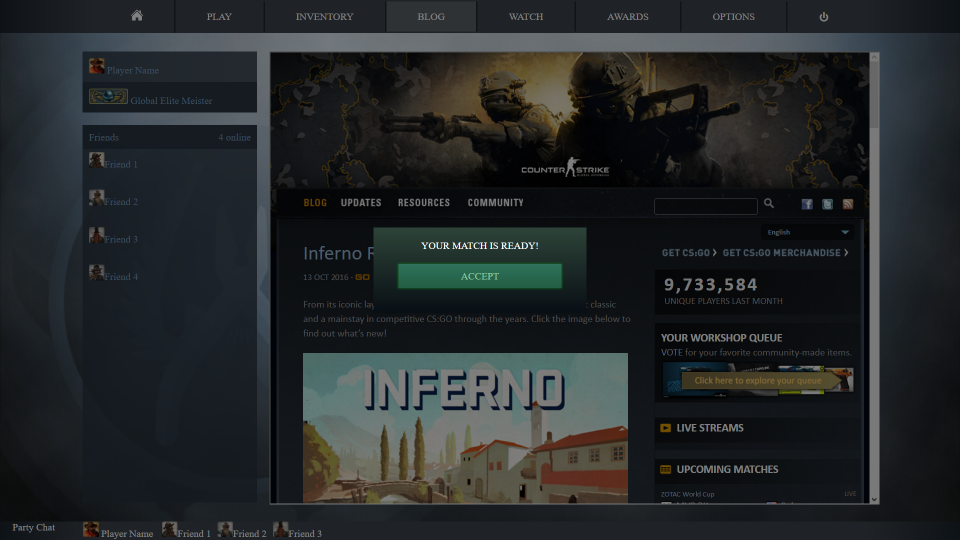
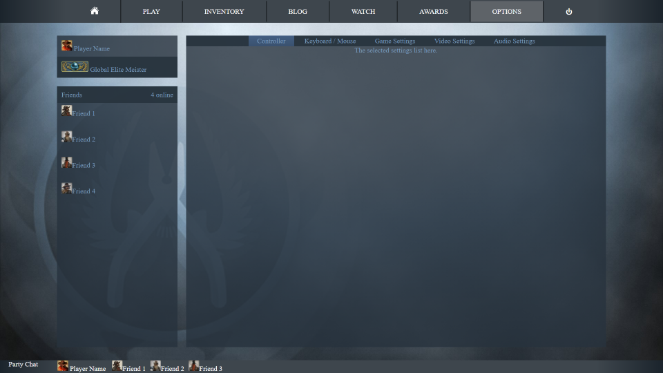

# Counter-strike UI Concept #

Some ideas on what the UI could potentially be like.

I have done a rough implementation of the concept as a webpage. I focused more on working on the functional part of the UI, not so much on the looks/style.

## [Try it out here!](http://nbpt.eu/app/cs_ui/) ##

Changes:
- Be able to move to any part of the UI, even when searching for a game.
- Have some components always available regardless of where you are in the UI (account name / friend list / party list / party chat).
- Add some keyboard shortcuts (to show the chat, move between the tabs, etc).
- When a match is found, show a message in the center of the screen.
- Add a home tab, which will be used to show/promote the various parts of the game (forum / skins / games to watch, etc).
- Add a store tab, where you'll see what is available to buy, and some featured items.

# Home #

The left and bottom side of the UI would be always accessible regardless of what the current tab is.

# Party Chat #

The party chat can be shown/hidden by clicking on the party chat button.
When searching for a match, there would be an indication on the bottom right side.

# Play #

You can go to any part of the UI while searching for a match. Once its found, a dialog will appear where you can accept it.

# Options #

You would be able to change the settings even while searching for a game, or talking with your party.

# Keyboard Shortcuts #

## In Accept Dialog #

- enter: Accept match.
- esc: Cancel match.

## In Play Tab ##

- ctrl + enter: Start searching for a match.
- esc: Cancel search.

## General ##

- ctrl + c: Open/close the party chat.
- ctrl + 1: Open home tab.
- ctrl + 2: Open play tab.
- ctrl + 3: Open inventory tab.
- ctrl + 4: Open blog tab.
- ctrl + 5: Open watch tab.
- ctrl + 6: Open awards tab.
- ctrl + 7: Open options tab.

`Note`: In the browser implementation use `shift + number` instead, since `ctrl + number` is reserved by the browser (for tab switching).

# Dependencies #

- [typescript](https://www.typescriptlang.org/): `2.0`
- [power symbol unicode font](http://unicodepowersymbol.com/)